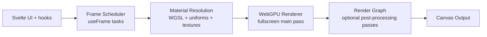

<div align="center">

# Motion GPU

**Svelte 5 + WebGPU runtime for fullscreen WGSL rendering, frame scheduling, and post-processing pipelines**

[](https://bun.sh)
[](https://svelte.dev)
[](https://gpuweb.github.io/gpuweb/)
[](https://www.typescriptlang.org)

</div>

## What this repository contains

This is a Bun workspace monorepo with two main parts:

| Path | Package | Purpose |
| --- | --- | --- |
| `packages/motion-gpu` | `@motion-core/motion-gpu` | Core Svelte/WebGPU runtime library |
| `apps/web` | `@motion-core/web` | Documentation site and examples |

## Core library summary

`@motion-core/motion-gpu` provides:

- `FragCanvas` as the runtime entry component for fullscreen rendering.
- `defineMaterial(...)` for strict WGSL material contracts (`frag(uv)` signature, defines/includes preprocessing, deterministic signatures).
- `useFrame(...)` for ordered task scheduling with render invalidation policies.
- `useMotionGPU()` for runtime context access (canvas, size, render mode, scheduler controls).
- `useTexture(...)` for reactive URL texture loading and cancellation-safe reload behavior.
- Built-in post-process passes: `BlitPass`, `CopyPass`, `ShaderPass`.
- Advanced entrypoint (`@motion-core/motion-gpu/advanced`) with `useMotionGPUUserContext` and extra scheduler/user-context types.

## Quick start

### 1. Install dependencies

```bash
bun install
```

### 2. Run docs app locally

```bash
bun run dev
```

The root `dev` command builds the library and starts `apps/web`.

## Workspace scripts

Run from repo root:

```bash
bun run dev
bun run build
bun run preview
bun run check
bun run lint
bun run format
```

Detailed script behavior:

| Command | What it does |
| --- | --- |
| `bun run dev` | Build `packages/motion-gpu`, then start `apps/web` dev server |
| `bun run build` | Build library, then production-build docs app |
| `bun run check` | Type/package checks for library + Svelte checks for web app |
| `bun run test` | Runs package tests and web tests (web currently has no test files by default) |
| `bun run lint` | Runs lint/prettier checks in both workspaces |

## Minimal usage example

```svelte
<script lang="ts">
	import { FragCanvas, defineMaterial } from '@motion-core/motion-gpu';

	const material = defineMaterial({
		fragment: `
fn frag(uv: vec2f) -> vec4f {
	return vec4f(uv.x, uv.y, 0.2, 1.0);
}
`
	});
</script>

<div style="width: 100vw; height: 100vh;">
	<FragCanvas {material} />
</div>
```

Animated uniform with `useFrame`:

```svelte
<script lang="ts">
	import { useFrame } from '@motion-core/motion-gpu';

	useFrame((state) => {
		state.setUniform('uTime', state.time);
	});
</script>
```

## Render pipeline model



## Browser/runtime notes

- WebGPU support is required.
- Use a secure context (`https` or localhost).
- Expected behavior on unsupported devices/browsers: runtime emits normalized error reports and optional overlay diagnostics.

## Documentation

Technical docs are implemented as `.svx` pages in:

- `apps/web/src/routes/docs`

Start locally with `bun run dev` and open the docs app.

## Package exports

Root entrypoint (`@motion-core/motion-gpu`):

- `FragCanvas`
- `defineMaterial`
- `useMotionGPU`
- `useFrame`
- `useTexture`
- `BlitPass`, `CopyPass`, `ShaderPass`

Advanced entrypoint (`@motion-core/motion-gpu/advanced`) additionally exports:

- `useMotionGPUUserContext`
- advanced scheduler and user-context types
